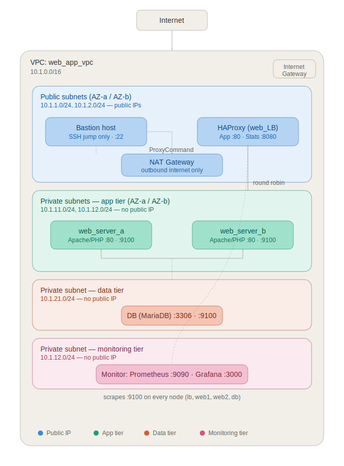

Full README for infra

# Multi-Tier AWS Infrastructure — Terraform

Terraform code that provisions a multi-AZ, 3-tier AWS environment for a
full-stack web application: a load-balanced web/app tier, a database tier,
and a dedicated monitoring node — all inside a custom VPC with public/private
subnet isolation, with a bastion host providing secure administrative access
to the private subnets.

Companion repo (configuration management):
[ansible_fullstack_webapp](https://github.com/amitkoundal02/ansible_fullstack_webapp)



## Architecture

- Custom VPC (10.1.0.0/16) with 2 public + 4 private subnets across two AZs
- Internet Gateway + NAT Gateway for controlled outbound access from private subnets
- Bastion host — the only SSH entry point into the private network
- HAProxy load balancer (public) — round-robin across 2 web/app servers (private)
- MariaDB (private) — reachable only from the web/app tier
- Monitoring node (private) — Prometheus + Grafana, scraping Node Exporter on every node
- Least-privilege security groups — e.g. the web tier only accepts inbound
  traffic from the load balancer's security group, never from a raw IP range
  
Internet

|

HAProxy (public) ---- Bastion (public)

|                       |

web1, web2 (private) ------+

|

MariaDB (private)

|

Monitor: Prometheus + Grafana (private)  


## Stack

Terraform >= 1.5.0 · AWS provider ~> 6.0 · HCP Terraform (remote state backend)

## Prerequisites

- AWS account with credentials configured
- An EC2 key pair already created in your target region
- Terraform installed locally

## Setup

```bash
git clone https://github.com/amitkoundal02/infa.git
cd infa
cp terraform.tfvars.example terraform.tfvars
# edit terraform.tfvars: set admin_ips to your own public IP(s)

terraform init
terraform plan
terraform apply
```

## Outputs

`terraform output server_ips` returns the bastion and load balancer public IPs,
plus the private IPs of the web, database, and monitoring nodes.

## Lab vs. production tradeoffs

| This lab | Production equivalent |
|---|---|
| Self-managed MariaDB on EC2 | Amazon RDS with Multi-AZ |
| Bastion host + SSH keys | AWS Systems Manager Session Manager |
| Fixed EC2 instances | Auto Scaling Group |
| Single monitoring node | HA Prometheus/Grafana, or managed observability |

## Notes

- `terraform.tfvars`, `*.pem`, and `terraform.tfstate*` are gitignored —
  never commit real credentials or state.
- Destroy when not in use: `terraform destroy` (NAT Gateway and EC2 instances
  bill hourly).  
  
